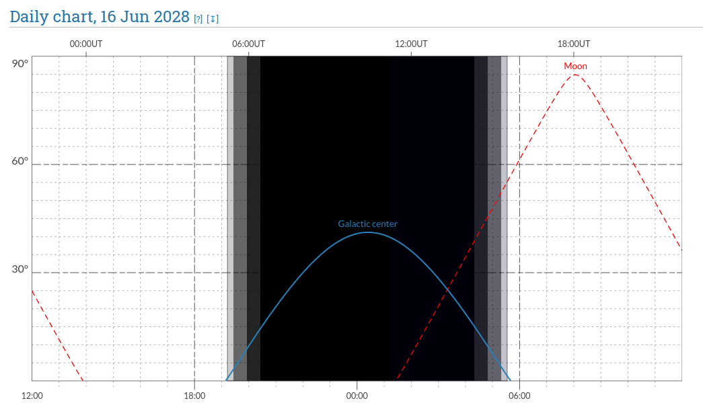
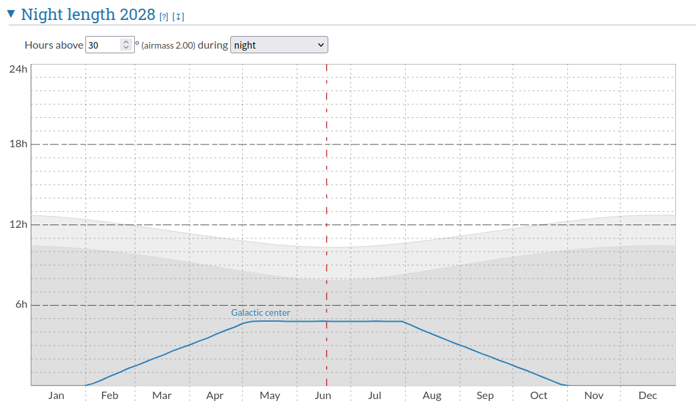

# Follow-up observation with Subaru Telescope

## Visibility from Subaru Telescope

すばる望遠鏡による銀河中心領域の観測可能性についてまとめる. 天体の高度や観測可能時間の計算には [Airmass](https://airmass.org/) を使用した. 計算結果には以下のリンクから直接アクセスできる.

- [https://airmass.org/chart/obsid:subaru/date:2028-06-16/object:Galactic%20center/ra:266.415009/dec:-29.006111](https://airmass.org/chart/obsid:subaru/date:2028-06-16/object:Galactic%20center/ra:266.415009/dec:-29.006111)

参考までに 2028 年 6 月 16 日の天体高度と時間関係を以下に示す. すばる望遠鏡から観測する場合, 天体の南中高度は 40&deg; ほどであり, 観測可能時間はおよそ 5 時間程度であるとわかる.

観測可能な最低高度を 30&deg; としたときの観測可能時間の推移を以下に示す. 真夜中に南中するのは 6 月中旬である. また, 最長観測時間 (&sim;5 時間) を達成可能なのは 5 月から 7 月にかけてである. 4, 8 月も観測できなくはないが, 観測可能時間は 3 時間程度に短くなる.

